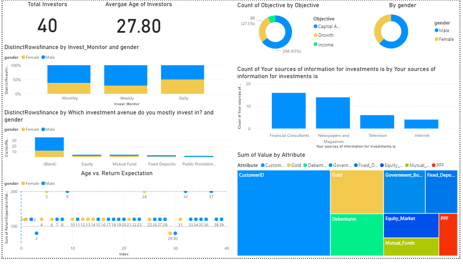

# 📊 Investment Dashboard in Power BI  

## 🔹 Introduction  
In today’s fast-paced financial world, understanding how investors allocate their funds across different avenues is essential for portfolio optimization and strategic planning.  

This Power BI Investment Dashboard explores investor preferences and behaviors, providing clear insights into how funds are distributed among:  

- Mutual Funds  
- Equity Markets  
- Gold  
- Government Bonds  
- Fixed Deposits  
- Public Provident Fund (PPF)  

By transforming raw financial data into meaningful visuals, this project delivers actionable intelligence for analysts, advisors, and decision-makers.  

---

## 🔹 Project Objectives 💡  
The main goals of this project are to uncover patterns and trends in investment behavior. Specifically, we aim to:  

1. Visualize Investment Distribution → Show the share of each investment avenue using treemaps.  
2. Identify the Most Popular Investments → Highlight top avenues by total preference score and investor count.  
3. Track Investor Trends → Monitor how preferences vary across demographics (e.g., gender, age) or over time.  
4. Aggregate Total Preferences → Calculate total preference scores across all investors.  
5. Highlight Investor Count → Display the number of unique investors engaged with different products.  

---

## 🔹 Data Preparation ⚙️  

### 1. Dataset Used  
- Table: Finance_data  
- Columns:  
  - Demographics: gender, age, Source (investment awareness source)  
  - Investments: Mutual_Funds, Equity_Market, Debentures, Government_Bonds, Fixed_Deposits, PPF, Gold  

### 2. Unpivoting Investment Columns  
To simplify analysis, investment columns were unpivoted in Power Query:  

- Original columns (Mutual_Funds → Gold) were transformed into:  
  - InvestmentType (categorical, e.g., Mutual_Funds, Gold)  
  - PreferenceScore (numeric, score/rank of preference)  

This conversion from wide format → long format made it possible to build dynamic, scalable visuals.  

### 3. Calculated Measures (DAX)  

Total Preference Score  
SUMX (  
    Finance_data,  
    Finance_data[Mutual_Funds] +  
    Finance_data[Equity_Market] +  
    Finance_data[Debentures] +  
    Finance_data[Government_Bonds] +  
    Finance_data[Fixed_Deposits] +  
    Finance_data[PPF] +  
    Finance_data[Gold]  
)  

Unique Investors  
DISTINCTCOUNT(Finance_data[InvestorID])  

---

## 🔹 Dashboard Features 🎨  
The interactive dashboard provides a comprehensive view of investor behavior, making it easy to explore investment avenues, demographics, and overall popularity.  

### Key Visuals 📈  
- Treemap → Displays share of each investment type (proportions & values).  
- Clustered Bar / Column Chart → Ranks the most popular investment avenues.  
- Stacked Bar Chart → Compares investment preferences by gender or age group.  
- Cards → Show KPIs such as Total Preference Score and Unique Investors.  
- Optional Line Chart → Visualizes investment trends over time (if time-based data is available).  

### Slicers & Filters  
- Demographics: Age, Gender  
- Investment Awareness: Source (Internet, Newspaper, Consultants, etc.)  
- All visuals update dynamically when slicers are applied, enabling deep exploration.  

---

## 🔹 Tools & Technologies 🛠️  
- Power BI Desktop → Dashboard building & visualization  
- Power Query → Data cleaning and reshaping (Unpivot transformation)  
- DAX (Data Analysis Expressions) → Creating calculated measures and KPIs  

---

## 🔹 Conclusion 🏁  
This Investment Dashboard empowers financial analysts, advisors, and decision-makers to:  

✔ Identify top-performing investment avenues  
✔ Track engagement patterns across demographics  
✔ Make data-driven portfolio strategies  
✔ Communicate findings effectively with clear visuals  

By transforming raw financial records into interactive analytics, this project demonstrates the power of Power BI in financial decision-making.  

---

## 🔹 Future Enhancements 🚀  
- Add time-series data to track how investment preferences evolve.  
- Integrate predictive analytics to forecast future investor behavior.  
- Build drill-through pages for detailed investor profiles.  
- Connect with real-time financial data sources for live dashboards.  

---

